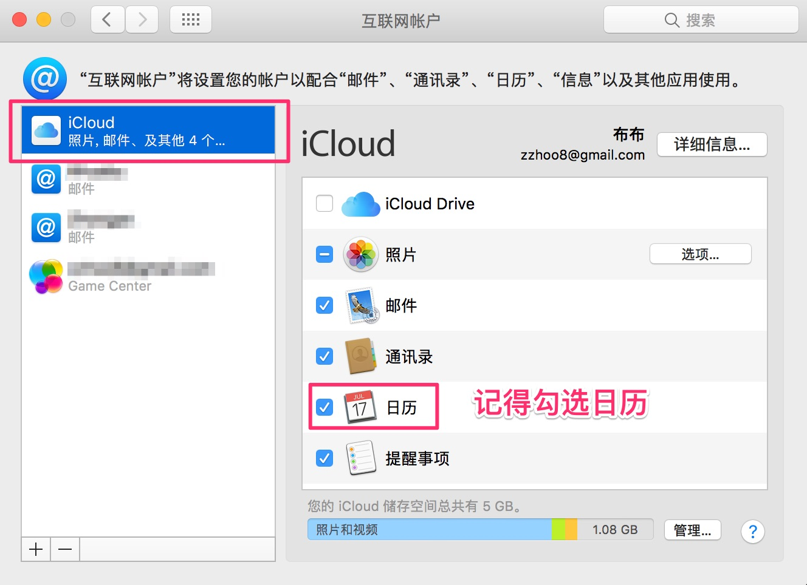
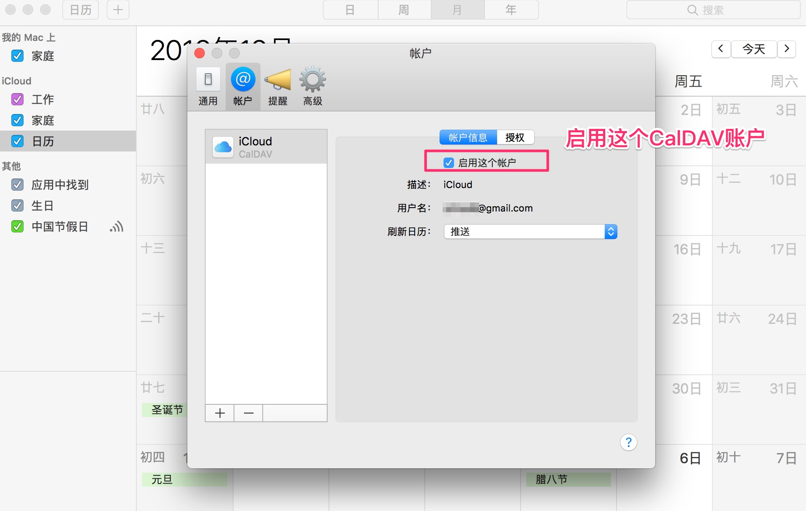
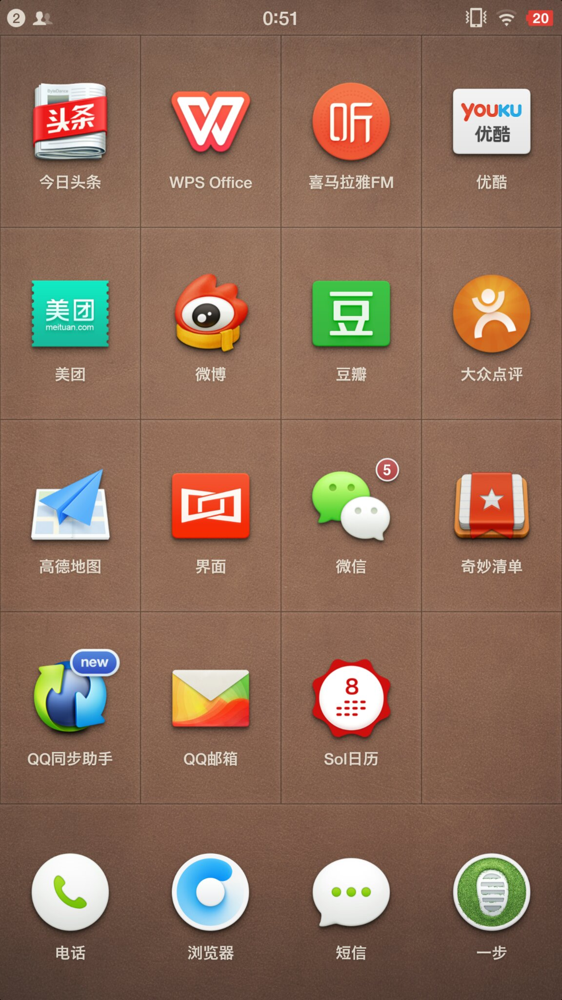
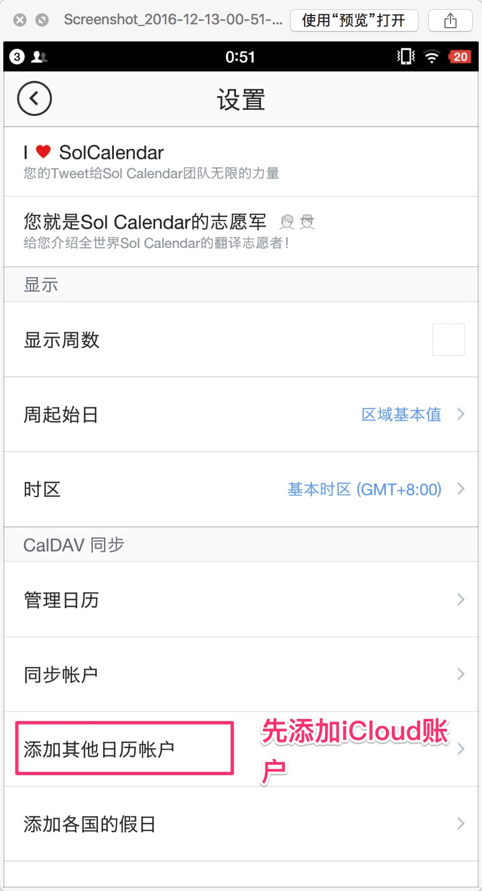
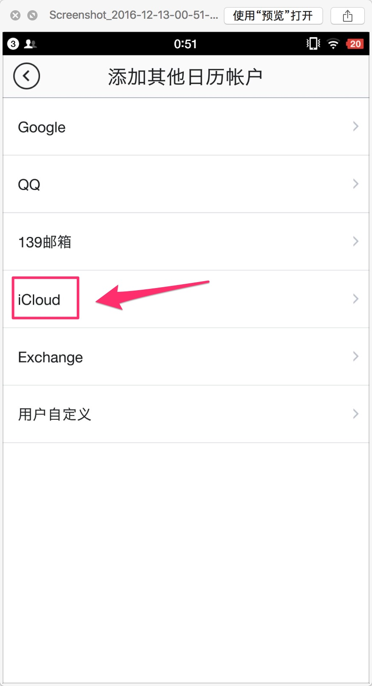
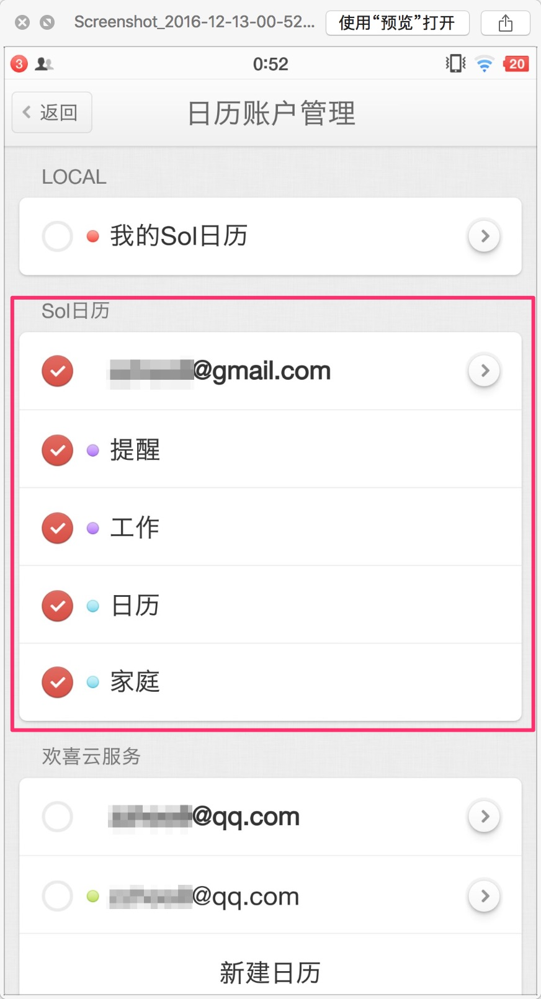
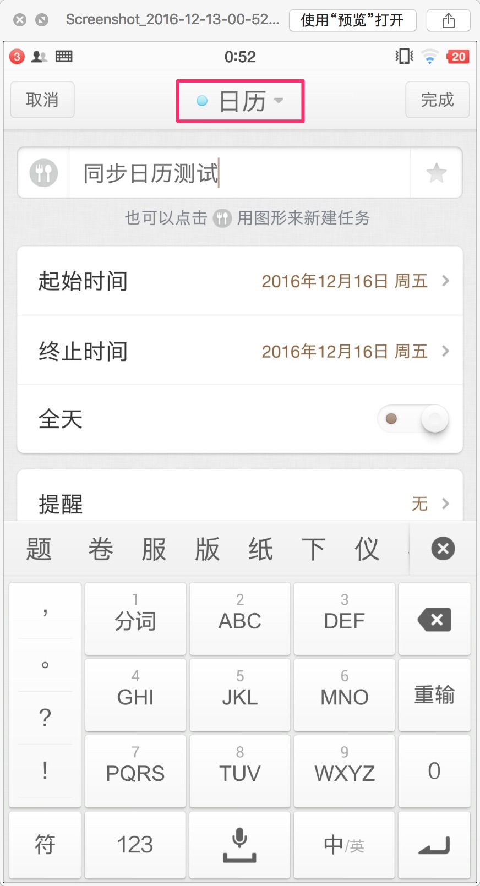
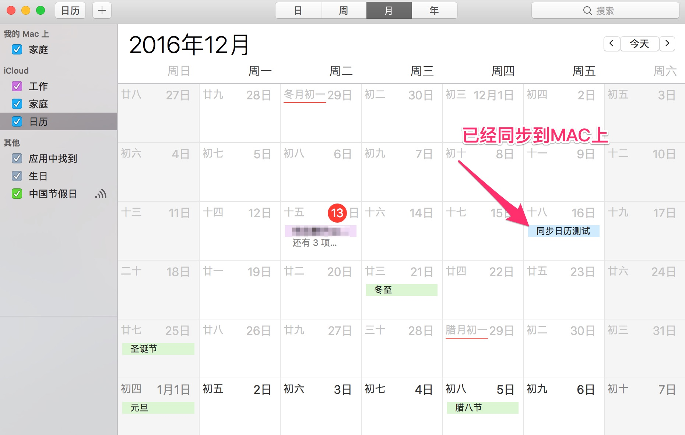

# 在MAC和安卓手机之间同步日历

> 需要在手机设备和MAC电脑之间进行日历和行程的同步，由于使用QQ邮箱账号时，在手机上创建的日历事件无法同步到其他设备上，反之是可以的，怀疑是QQ邮箱的问题，因此建议使用iCloud的账号进行同步（google账号由于阉割和被墙等原因，也无法使用）

## MAC侧设置

1. 设置 -> 互联网账户 -> 增加一个iCloud账户

2. 打开“日历”应用，确认启用该iCloud账户中的日历同步功能

## 安卓手机侧设置

1. 应用市场中下载`Sol日历`

2. 在`Sol日历`的设置中添加日历账户

3. 选择iCloud账户，输入邮箱和密码

4. 在系统`日历`应用中，就可以按到iCloud账号下的日历

## 同步日历

1. 在手机侧创建日历事件，注意选择的日历需要是上面步骤创建的iCloud账号下的日历

2. 需要手工点击同步数据

3. 在MAC上刷新日历应用`Command + R`

